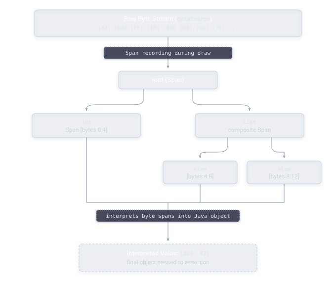
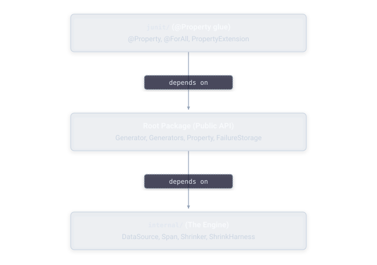
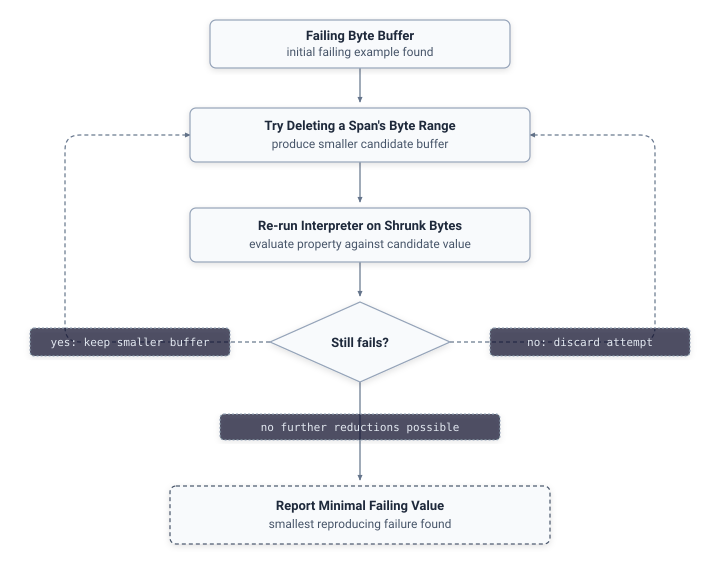

# Architecture

Underneath JHusk's public API, every generator is ultimately an interpreter over a stream of bytes supplied by a `DataSource`. Rather than each generator type implementing its own randomness and its own shrinking behavior, generation and shrinking both operate on that shared byte stream, which is what allows a single general-purpose shrinker to work correctly across every generator, custom or built-in, without any generator author needing to implement shrinking logic themselves.

  

## Package layering

The codebase is organized in three layers, each depending only on the one below it:

  

- **`internal/`** — the engine. `DataSource` is the raw byte stream every generator reads from. `Span` records which stretch of bytes produced which value, so the shrinker knows what's safe to delete. `Shrinker`/`ShrinkHarness` run the actual minimization search.
- **Root package** — the public API. `Generator`, `Generators`, `Property`, `FailureStorage`, and the exception hierarchy. Everything you touch directly as a user.
- **`junit/`** — the JUnit 5 integration layer. `@Property`, `@ForAll`, and `PropertyExtension` wire the public API into JUnit's test lifecycle.

## Encoding decisions

A handful of specific encoding choices shape how generation and shrinking behave in practice.

**Bounded integer ranges are encoded through multiplicative scaling**, computed as `(raw * range) >>> 32`, rather than a naive modulo operation. Modulo was tried first and found to produce non-monotonic shrinking behavior, where a byte-stream value that should shrink toward a smaller output didn't reliably do so. Multiplicative scaling avoids that problem.

**Collections are encoded using a continuation-flag scheme** rather than a length-prefix scheme. Each element is preceded by a flag indicating whether another element follows. This matters specifically because it allows the shrinker to delete a span of bytes corresponding to one element cleanly, without needing to separately patch up a length value stored elsewhere in the stream. It's also the reason very large collections carry a real, though usually invisible, byte cost: every element pays for its own continuation flag, and that cost compounds across the full collection.

**The `DataSource` that backs all of this holds a fixed internal buffer**, 8KB by default. Most properties never come close to this limit. But for a generator asked to produce, say, tens of thousands of elements, the cumulative byte cost of continuation flags and element data can exceed that cap before generation completes. When that happens, the run reports `GenerationBudgetExceededException` for an exhausted invalid-run budget, rather than silently producing a truncated or incorrect value. This is a deliberate design tradeoff: the cap keeps the byte stream, and therefore the shrinking search space, bounded and fast, at the cost of an explicit ceiling on how large a single generated value can be by default. That ceiling is configurable per property through `withGenerationBudget(int)` — see [Guide: Properties](../guide/properties.md).

**Shrink targets are chosen deliberately rather than defaulting to zero everywhere.** Integers shrink toward zero, booleans shrink toward `false`, collections shrink toward empty, but bounded integer ranges shrink toward their minimum value, not toward zero. This matters for a range like `integers(50, 100)`, where zero isn't even a valid value in the first place — shrinking toward the range's actual minimum produces a sensible, in-range minimal failure instead of an impossible one.

**Failure persistence is written using a write-to-temporary-file-then-atomic-rename pattern**, rather than writing directly to the final file path. Naive direct writes were found, during this project's own testing, to produce torn reads under concurrent load — a genuine bug that's now fixed through this atomic approach. This is also what underlies the concurrency guarantees described in [Guide: Understanding Failures](../guide/failures.md).

## The shrinking algorithm

  

Shrinking works by minimizing the underlying byte stream directly, then re-running every generator's interpretation logic on the shrunk bytes to get a smaller value. Concretely: the shrinker tries deleting a `Span`'s byte range, re-runs the interpreter on the resulting shorter buffer, and checks whether the property still fails. If it does, the smaller buffer replaces the current best failure and the search continues from there; if it doesn't, that particular reduction is discarded and a different one is tried. This repeats until no further reduction still reproduces the failure.

## Exception hierarchy

`Property.check()` distinguishes two categories of failure through its exception hierarchy. `AssertionError` is reserved for genuine property falsification — a value was generated, the assertion ran, and it genuinely failed, mirroring JUnit's own convention where `AssertionFailedError` extends `AssertionError`. `PropertyExecutionException`, which extends `RuntimeException`, covers cases where a normal check cycle couldn't complete at all: an exhausted invalid-run budget or a generator crash. It has three subtypes covering the specific cause — `FilterExhaustedException`, `GenerationBudgetExceededException`, and `GeneratorCrashException` — so code that wants to distinguish an over-restrictive filter from an exhausted generation budget from a crashing generator can catch the specific subtype instead of parsing the message.

This split exists because `AssertionError` does not extend `RuntimeException`, so code that wraps `check()` in a `catch (RuntimeException e)` needs `PropertyExecutionException` (or one of its subtypes) to actually be catchable that way, while still letting a real, assertion-driven test failure propagate as a true `AssertionError`, exactly as JUnit itself expects.
