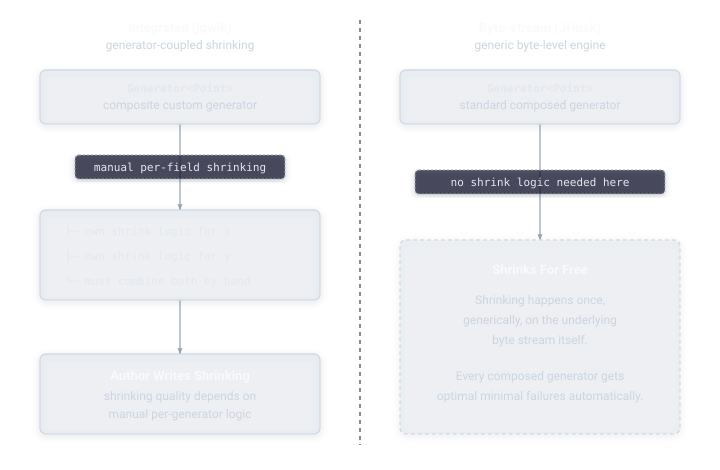

# JHusk vs. Other Property-Based Testing Libraries

Within Java, JHusk sits alongside a handful of established options, each with a different design philosophy.

**jqwik** is the most established property-based testing library on the JVM today, built directly on JUnit 5. It uses integrated, tree-based shrinking, where each generator carries its own logic for shrinking itself. It's a mature, carefully implemented library, and the difference between it and JHusk is architectural rather than a claim that one is categorically better than the other.

**QuickTheories** is a lighter-weight JVM library that supports both shrinking and targeted, coverage-guided search for failures.

**junit-quickcheck** is one of the earliest Java property-based testing tools, built on JUnit 4's theories mechanism. It added shrinking support in a later release, though JUnit 4 itself has since moved into maintenance mode.

Beyond Java, the same underlying idea shows up across most major language ecosystems: **Hypothesis** in Python, the library that popularized modern property-based testing outside the Haskell world, and the direct design inspiration for JHusk's shrinking approach; **QuickCheck** in Haskell, the original property-based testing library, created by Koen Claessen and John Hughes in 2000, and the ancestor of everything else in this space; **Hedgehog**, a later Haskell alternative with its own take on integrated shrinking; **fast-check** for JavaScript and TypeScript; **PropEr** for Erlang; **test.check** for Clojure; **ScalaCheck** for Scala; and **RapidCheck** for C++.

## JHusk vs. jqwik, in depth

The specific difference between JHusk and jqwik is worth spelling out in more depth, since they're the two most directly comparable options on the JVM.

jqwik's integrated shrinking means shrinking quality depends partly on how well each individual generator's shrinking logic was written, including any custom generator a user writes themselves. JHusk's internal shrinking works generically, once, over the underlying byte stream shared by every generator, so a custom generator built through composition (see [Guide: Generators](../guide/generators.md)) inherits high-quality shrinking automatically, without its author writing any shrinking logic at all.

jqwik and QuickTheories already answer the question of whether Java has property-based testing. JHusk is aimed at a narrower, more specific question: whether Java has property-based testing with Hypothesis-grade shrinking. As far as this library's author is aware, nothing else on the JVM has answered that second question yet.

## Acknowledgments

JHusk's shrinking design is a direct descendant of Hypothesis, created by David R. MacIver, and its internal engine, Conjecture. The choice to treat every generator as an interpreter over a shared byte stream, rather than giving each generator its own independent shrinking logic, comes directly from that project's approach, and this library exists largely as an attempt to bring that same idea to the JVM.

Property-based testing itself traces back to QuickCheck, created by Koen Claessen and John Hughes for Haskell in 2000. Both Hypothesis and QuickCheck did the hard conceptual work this library builds on, and neither JHusk's design nor its documentation would have been possible without them.

Thanks are also due to the broader lineage of property-based testing tools across the Java ecosystem and beyond — jqwik, QuickTheories, junit-quickcheck, Hedgehog, fast-check, PropEr, test.check, ScalaCheck, and RapidCheck among them — for continuing to demonstrate, each in their own language and their own way, that this style of testing is worth the investment.

## Next

- [Architecture](architecture.md) — the mechanics behind JHusk's byte-stream shrinking
