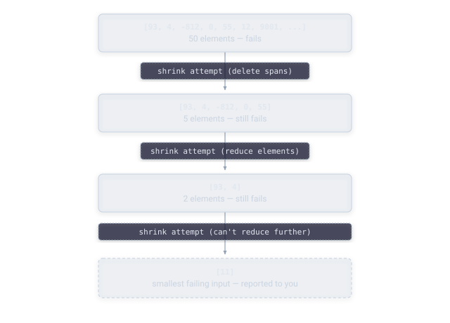
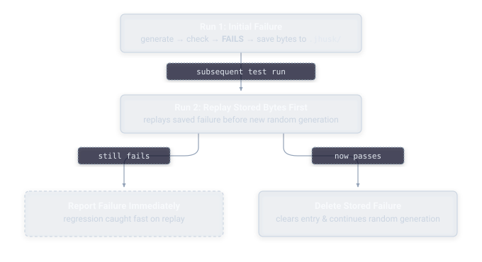

# Guide: Understanding Failures

When a property fails, JHusk doesn't just tell you something went wrong. It hands you a full report designed to get you to the root cause as quickly as possible.

## Reading a shrunk failure

Here's what a real shrunk failure looks like. A property asserting no list element exceeds 10 fails on a 50-element list of random positive integers:

```
Falsifying (shrunk) value:
  [11]

Original (unshrunk) value:
  [20695, 93362, 75080, ... 95741]

Reproduction:
  To reproduce this exact failure, run: check(7L) (Seed: 7L)

Execution Statistics:
  Examples run: 2
  Invalid runs: 0
  Shrink attempts: 217

Original Exception:
  org.opentest4j.AssertionFailedError: no element may exceed 10 ==> expected: <true> but was: <false>
```

JHusk searches for a smaller version that still fails, and reports the minimal case: a 50-element mess shrinks to a single element, `11`, one past the boundary the property actually cares about. Rather than staring down fifty arbitrary numbers trying to spot a pattern, you're looking at exactly the value that matters.



## Shrinking, seeds & reproducibility

Every JHusk run is driven by a seed, a single `long` value that deterministically controls every random decision the run makes, from which values get generated to how the shrinking search proceeds. Two runs with the same seed against the same property will always produce identical results.

Calling `check(7L)` on that same property will deterministically walk through the exact same sequence of generated values and land on the exact same failure, every time. This matters enormously for debugging: once you've got the seed, you can set a breakpoint, add logging, or step through in a debugger with total confidence you're looking at the actual failing scenario, not a fresh random run that happens to look similar.

Not passing a seed at all, calling plain `check()`, draws a fresh seed each time, which is what you want for everyday test runs, since it means each run explores a different slice of the input space over time rather than always checking the same fixed set of examples.

## Failure persistence

Beyond seed-based reproduction within a single debugging session, JHusk also keeps a longer-lived memory of failures across separate runs entirely.



Once JHusk finds a failing input, it saves the byte stream that produced it to a local file, by default under a `.jhusk` directory relative to your project. The next time that property runs, JHusk replays that stored failure first, before generating any new random examples. This means a bug you believed was fixed can't quietly resurface without JHusk catching it immediately on the very next run, since the exact input that broke things before is checked again automatically.

This persistence is written atomically — JHusk writes to a temporary file and then renames it into place, rather than writing directly to the final file. That matters if you're running property tests concurrently across multiple `Property` instances sharing a storage directory: a reader can never observe a torn or partially-written failure file, even under concurrent writes. What's still true is that concurrent writes to the same identity race for which one's failure ends up stored — one atomic rename simply wins over the other, but the file itself is never corrupted by the race.

If you ever want to discard stored failures, for instance after intentionally changing behavior in a way that makes an old failure no longer relevant, deleting the relevant file, or the whole `.jhusk` directory, clears that history. JHusk will simply start generating fresh examples again on the next run.

## What you see in your terminal

When running under JUnit, JHusk groups results by test class and reports a formal `PASS`/`FAIL` summary as each property completes, followed by one final summary once the whole run finishes:

```
CommandsTest
  PASS  correctStackPasses                       100 examples   0.16s

--------------------------------------------------
Summary: 168 passed, 0 failed, 1 skipped
Examples: 12,847
Duration: 13.5s
--------------------------------------------------
```

A failing property expands with the full shrunk report shown above, immediately, rather than waiting until the whole run finishes.

## Next

- [Troubleshooting](../troubleshooting.md) — common mistakes and how to read the exception you're seeing
- [Architecture](../design/architecture.md) — how shrinking actually works underneath the byte stream
