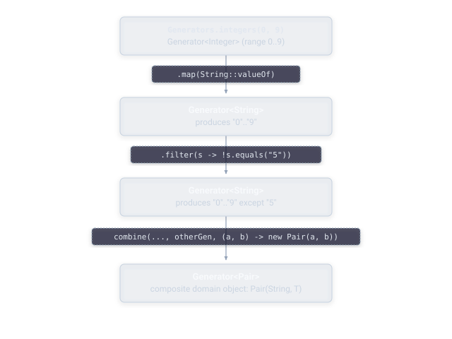

# Guide: Generators

A **generator** describes how to produce a random value of a given type: an integer, a string, a list, or a custom object built from your own domain. Generators are composable. You build complex ones out of simple ones using operations like `map`, `filter`, and `flatMap`, instead of writing each one from nothing.

## Working with `Generators`

The `Generators` class is where most of your day-to-day work with JHusk happens. It provides factory methods for primitives, collections, and combinators for building more complex generators out of simpler ones.

For primitives:

```java
Generators.integers()              // any int
Generators.integers(0, 100)        // an int within a range, inclusive
Generators.longs()
Generators.doubles()
Generators.booleans()
Generators.characters()
Generators.strings()
```

Bounded integer ranges are worth calling out specifically, since they're extremely common in real tests. `Generators.integers(min, max)` generates a value anywhere in that inclusive range, and JHusk's shrinker knows to shrink toward `min`, not toward zero, which matters when your range doesn't include zero at all.

For collections:

```java
Generators.lists(Generators.integers())              // a list of ints, default size range
Generators.lists(Generators.integers(), 0, 20)        // a list of ints, 0 to 20 elements
Generators.sets(Generators.integers(0, 10))
Generators.maps(Generators.strings(), Generators.integers())
```

For combining and transforming generators:

```java
Generators.just(42)                                    // always produces the same value
Generators.oneOf(genA, genB, genC)                      // picks one of several generators
Generators.combine(genA, genB, (a, b) -> new Thing(a, b))
Generators.optionals(Generators.integers())             // a generator that may produce null
```

A quick and important note on `Generators.optionals()`: it returns `Generator<T>`, not `Generator<Optional<T>>`. The value it produces may be a plain Java `null`, rather than wrapped in an `Optional`. This has caught more than one person off guard, so it's worth remembering the first time you reach for it.

## Composing custom generators

Almost every generator you'll actually use in a real test suite is built by composing the primitives above, rather than writing a generator from first principles. The three composition tools you'll reach for most often are `map`, `filter`, and `flatMap`, along with the standalone `combine` function for joining multiple independent generators together.



`map` transforms the output of a generator without changing how often it runs or what values it can produce, it just applies a function to whatever comes out:

```java
Generator<String> digitStrings = Generators.integers(0, 9).map(String::valueOf);
```

`filter` narrows a generator down to only the values that satisfy a predicate. Values that don't satisfy the predicate are discarded and JHusk tries again:

```java
Generator<Integer> evenNumbers = Generators.integers().filter(n -> n % 2 == 0);
```

Filters should be used carefully. A filter that rejects most of the values a generator produces forces JHusk to work harder to find a valid example, and a filter that's nearly impossible to satisfy can cause a run to exhaust its budget entirely — see [Troubleshooting](../troubleshooting.md) for what that looks like and how to fix it.

`flatMap` lets one generator's output determine the shape of a second generator:

```java
Generator<List<Integer>> sameLengthLists =
    Generators.integers(0, 10).flatMap(size -> Generators.lists(Generators.integers(), size, size));
```

For combining several independent generators into a single custom type, `Generators.combine` is usually the cleanest tool:

```java
Generator<Point> points = Generators.combine(
    Generators.integers(-1000, 1000),
    Generators.integers(-1000, 1000),
    Point::new
);
```

This builds a generator for a custom `Point` type out of two integer generators, with no manual randomness or bounds-checking code required. Because JHusk's shrinking works generically over the underlying byte stream (see [Architecture](../design/architecture.md)), this composed generator gets the same quality of shrinking as any built-in generator, without its author writing a single line of shrinking logic.

For a custom type built from several fields, this pattern scales naturally: keep composing `combine` calls, or nest `flatMap` where one field's valid range genuinely depends on another's, and the resulting generator will shrink sensibly without any additional effort.

## Next

- [Guide: Properties](properties.md) — configuring the property that runs your generators
- [Guide: Understanding Failures](failures.md) — what happens when a generated value breaks your rule
