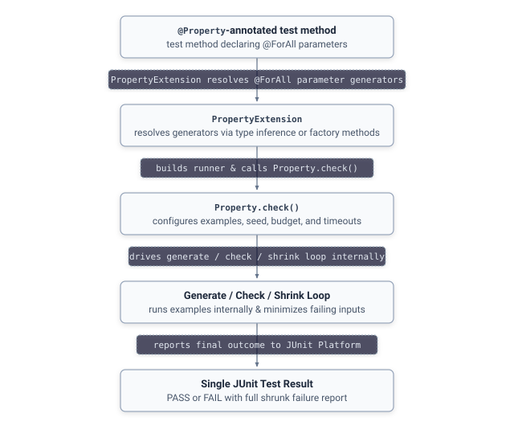

# Guide: JUnit Integration

JHusk integrates natively with JUnit 5 through the `@Property` annotation, paired with `@ForAll` on each parameter that should be filled in by a generator.

Properties run alongside regular `@Test` methods in the same test class, appear in the same test reports, and behave like any other JUnit 5 test as far as your build tool and CI setup are concerned. A `@Property` method shows up as a single test in your report, not one entry per generated example, even though internally it's running JHusk's full generate, check, and shrink loop against potentially hundreds of inputs.

<p align="center">
  
</p>

## What actually happens underneath

`@Property` makes the annotated method a JUnit 5 test template, powered by `PropertyExtension`. When JUnit encounters it, the extension resolves a generator for every `@ForAll` parameter, builds a `Property` runner configured from the annotation's attributes, and calls `check()` — invoking your method once per generated example, internally, rather than JUnit invoking it directly. If any example falsifies the property, the test fails with the full shrunk report described in [Understanding Failures](failures.md), formatted the same way JUnit formats any other assertion failure.

Because this integration builds directly on JUnit's own extension mechanism, `@Property` methods work correctly with everything else JUnit 5 already offers: nested test classes, display names, tags for selectively running subsets of your suite, and your existing CI configuration, all without any special handling.

## `@Property`'s attributes

```java
@Property(examples = 500, seed = "42L", name = "my-property", timeoutMillis = 2000)
void myProperty(@ForAll int a, @ForAll int b) {
    // ...
}
```

- **`examples`** — the number of successful examples required for the property to pass. Default is 100.
- **`seed`** — an explicit master seed (e.g. `"12345L"`). If empty, a random seed is used each run.
- **`name`** — an explicit identity name for this property, used for storing and replaying minimal shrunk failures persistently across refactors. If empty, JHusk derives the identity from the method itself.
- **`generationBudget`** — an explicit per-example generation buffer capacity in bytes, overriding the default 8KB. Use this when your generators (large collections, long strings, deep nesting) legitimately need more than the default and would otherwise throw `GenerationBudgetExceededException`.
- **`timeoutMillis`** — an explicit per-example timeout in milliseconds, overriding the default of no timeout. Use this when the annotated method might legitimately hang, so JHusk fails fast with a `PropertyTimeoutException` instead of hanging the whole test run.

## `@ForAll`'s type inference

For simple types — `int`, `long`, `double`, `char`, `boolean`, `String` — a bare `@ForAll` works without needing a named generator method at all:

```java
@Property
void additionIsCommutative(@ForAll int a, @ForAll int b) {
    assertEquals(a + b, b + a);
}
```

For anything else — generic types like `List<Integer>`, or your own custom types — you need an explicit generator factory, since generic types are erased at runtime and JHusk can't infer a generator for one automatically:

```java
static Generator<List<Integer>> integerLists() {
    return Generators.lists(Generators.integers());
}

@Property
void reversingTwiceReturnsTheOriginalList(@ForAll("integerLists") List<Integer> list) {
    // ...
}
```

The referenced method must be `static`, take no arguments, and return a `Generator<T>`.

## Next

- [Guide: Understanding Failures](failures.md) — reading a shrunk report, seeds, and failure persistence
- [Troubleshooting](../troubleshooting.md) — common mistakes when setting up a `@Property` test
