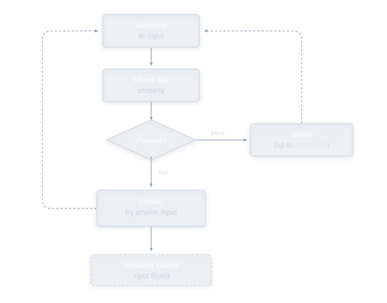

# Quickstart

Here's the shortest path from nothing to a passing property test.

## Before you start

Make sure your project has a working JUnit 5 test setup. If you already have `@Test` methods running successfully with `mvn test` or `gradle test`, you're ready to go — no additional configuration is needed for JHusk beyond the dependency itself (see [Installation](installation.md) if you haven't added it yet).

## The core loop

Every property test JHusk runs follows the same cycle: generate an input, check it against your rule, and if it fails, shrink it down to the smallest input that still breaks the rule.



<svg xmlns="http://www.w3.org/2000/svg" viewBox="0 0 640 500" width="100%" height="100%" style="max-width: 640px; display: block; margin: 20px auto; background: transparent; font-family: -apple-system, BlinkMacSystemFont, 'Segoe UI', Roboto, 'Helvetica Neue', Arial, sans-serif;">
<defs>
<filter id="box-shadow" x="-10%" y="-10%" width="125%" height="125%">
<feDropShadow dx="0" dy="2" stdDeviation="3" flood-color="#000000" flood-opacity="0.25"/>
</filter>
<marker id="arrow-grey" viewBox="0 0 10 10" refX="7" refY="5" markerWidth="6" markerHeight="6" orient="auto-start-reverse">
<path d="M 0 1.5 L 8 5 L 0 8.5 z" fill="#94a3b8"/>
</marker>
</defs>
<style>
.node-box { fill: rgba(148, 163, 184, 0.12); stroke: #cbd5e1; stroke-width: 1.2; filter: url(#box-shadow); }
.node-decision { fill: rgba(148, 163, 184, 0.12); stroke: #cbd5e1; stroke-width: 1.2; filter: url(#box-shadow); }
.node-terminal { fill: rgba(148, 163, 184, 0.12); stroke: #cbd5e1; stroke-width: 1.2; stroke-dasharray: 4 3; filter: url(#box-shadow); }
.edge-line { fill: none; stroke: #94a3b8; stroke-width: 1.2; }
.edge-loop { fill: none; stroke: #94a3b8; stroke-width: 1.2; stroke-dasharray: 4 3; }
.text-title { fill: #f8fafc; font-size: 13px; font-weight: 600; text-anchor: middle; }
.text-sub { fill: #cbd5e1; font-size: 12px; font-weight: 400; text-anchor: middle; }
.text-accent { fill: #e2e8f0; font-family: ui-monospace, SFMono-Regular, Menlo, Monaco, Consolas, monospace; font-size: 11px; }
.text-label { fill: #e2e8f0; font-size: 11px; font-weight: 500; }
</style>
<path d="M 160 344 L 85 344 Q 70 344 70 329 L 70 66 Q 70 51 85 51 L 162 51" class="edge-loop" marker-end="url(#arrow-grey)"/>
<line x1="250" y1="78" x2="250" y2="108" class="edge-line" marker-end="url(#arrow-grey)"/>
<line x1="250" y1="168" x2="250" y2="198" class="edge-line" marker-end="url(#arrow-grey)"/>
<line x1="324" y1="231" x2="408" y2="231" class="edge-line" marker-end="url(#arrow-grey)"/>
<text x="360" y="223" class="text-label" text-anchor="middle">pass</text>
<path d="M 499 204 L 499 66 Q 499 51 484 51 L 338 51" class="edge-loop" marker-end="url(#arrow-grey)"/>
<line x1="250" y1="258" x2="250" y2="308" class="edge-line" marker-end="url(#arrow-grey)"/>
<text x="262" y="288" class="text-label">fail</text>
<line x1="250" y1="374" x2="250" y2="414" class="edge-line" marker-end="url(#arrow-grey)"/>
<rect x="170" y="24" width="160" height="54" rx="6" class="node-box"/>
<text x="250" y="46" class="text-title">Generate</text>
<text x="250" y="63" class="text-sub">an input</text>
<rect x="170" y="114" width="160" height="54" rx="6" class="node-box"/>
<text x="250" y="136" class="text-title">Check the</text>
<text x="250" y="153" class="text-sub">property</text>
<polygon points="250,198 324,231 250,264 176,231" class="node-decision"/>
<text x="250" y="236" class="text-title">Passed?</text>
<rect x="414" y="204" width="170" height="54" rx="6" class="node-box"/>
<text x="499" y="226" class="text-title">repeat</text>
<text x="499" y="243" class="text-sub">(up to <tspan class="text-accent">examples</tspan>)</text>
<rect x="160" y="314" width="180" height="60" rx="6" class="node-box"/>
<text x="250" y="337" class="text-title">Shrink:</text>
<text x="250" y="354" class="text-sub">try smaller input</text>
<rect x="150" y="420" width="200" height="52" rx="6" class="node-terminal"/>
<text x="250" y="442" class="text-title">smallest failing</text>
<text x="250" y="459" class="text-sub">input found</text>
</svg>

## Step 1: Decide what rule to check

Property-based testing works best when you can state something that should always be true, regardless of the specific input. Common patterns include:

- **Round-tripping**: encoding then decoding a value returns the original value.
- **Invariants**: a sorted list stays the same length as the original, a set never contains duplicates.
- **Idempotence**: applying an operation twice produces the same result as applying it once.
- **Comparisons against a simpler reference implementation.**

## Step 2: Write the property

Use `@Property` and `@ForAll`, as shown below.

```java
static Generator<List<Integer>> integerLists() {
    return Generators.lists(Generators.integers());
}

@Property
void reversingTwiceReturnsTheOriginalList(@ForAll("integerLists") List<Integer> list) {
    List<Integer> reversed = new ArrayList<>(list);
    Collections.reverse(reversed);
    Collections.reverse(reversed);
    assertEquals(list, reversed);
}
```

JHusk generates a hundred lists by default, including empty ones, single-element ones, and ones with duplicates, and checks this assertion against every one of them.

Notice the explicit `@ForAll("integerLists")`, pointing at a static generator factory method, rather than a bare `@ForAll`. This is necessary because generic types like `List<Integer>` are erased at runtime, so JHusk can't infer a generator for one automatically the way it can for simpler types like `int`, `long`, `double`, `char`, `boolean`, or `String`. For those simpler types, a bare `@ForAll` works without needing a named generator method at all.

## Step 3: Run it

A `@Property` method behaves like any other JUnit 5 test as far as your build and CI setup are concerned. It shows up as a single test in your test report, not one per generated example, and internally runs JHusk's full generate, check, and shrink loop.

## Next

- [Guide: Generators](guide/generators.md) — building custom generators for your own types
- [Guide: Understanding Failures](guide/failures.md) — what happens when a property actually fails
- [Guide: JUnit Integration](guide/junit-integration.md) — the full set of `@Property` options
