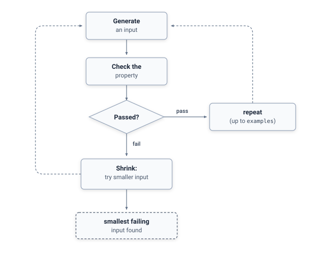

# Quickstart

Here's the shortest path from nothing to a passing property test.

## Before you start

Make sure your project has a working JUnit 5 test setup. If you already have `@Test` methods running successfully with `mvn test` or `gradle test`, you're ready to go — no additional configuration is needed for JHusk beyond the dependency itself (see [Installation](installation.md) if you haven't added it yet).

## The core loop

Every property test JHusk runs follows the same cycle: generate an input, check it against your rule, and if it fails, shrink it down to the smallest input that still breaks the rule.

<p align="center">
  
</p>

## Step 1: Decide what rule to check

Property-based testing works best when you can state something that should always be true, regardless of the specific input. Common patterns include:

- **Round-tripping**: encoding then decoding a value returns the original value.
- **Invariants**: a sorted list stays the same length as the original, a set never contains duplicates.
- **Idempotence**: applying an operation twice produces the same result as applying it once.
- **Comparisons against a simpler reference implementation.**

## Step 2: Write the property

Use `@Property` and `@ForAll`, as shown below.

```java
static Generator<List<Integer>> integerLists() {
    return Generators.lists(Generators.integers());
}

@Property
void reversingTwiceReturnsTheOriginalList(@ForAll("integerLists") List<Integer> list) {
    List<Integer> reversed = new ArrayList<>(list);
    Collections.reverse(reversed);
    Collections.reverse(reversed);
    assertEquals(list, reversed);
}
```

JHusk generates a hundred lists by default, including empty ones, single-element ones, and ones with duplicates, and checks this assertion against every one of them.

Notice the explicit `@ForAll("integerLists")`, pointing at a static generator factory method, rather than a bare `@ForAll`. This is necessary because generic types like `List<Integer>` are erased at runtime, so JHusk can't infer a generator for one automatically the way it can for simpler types like `int`, `long`, `double`, `char`, `boolean`, or `String`. For those simpler types, a bare `@ForAll` works without needing a named generator method at all.

## Step 3: Run it

A `@Property` method behaves like any other JUnit 5 test as far as your build and CI setup are concerned. It shows up as a single test in your test report, not one per generated example, and internally runs JHusk's full generate, check, and shrink loop.

## Next

- [Guide: Generators](guide/generators.md) — building custom generators for your own types
- [Guide: Understanding Failures](guide/failures.md) — what happens when a property actually fails
- [Guide: JUnit Integration](guide/junit-integration.md) — the full set of `@Property` options
